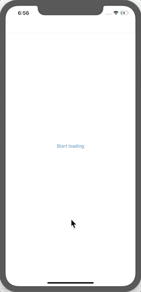

#  LoadingAsync

Creating a Async task with Combine, react to it by AlertViewController.

## One time Timer
```swift
Just<Void>(()) // `()` represent Void
	.delay(for: .seconds(loadTime), scheduler: queue)
```

## Alert with UIActivityIndicatorView

This technic was learned from https://stackoverflow.com/a/34268704/10172299
```swift
let alert = UIAlertController(title: nil, message: "Please wait...", preferredStyle: .alert)
let loadingIndicator = UIActivityIndicatorView(frame: CGRect(x: 10, y: 5, width: 50, height: 50))
loadingIndicator.hidesWhenStopped = true
loadingIndicator.style = .medium
loadingIndicator.startAnimating();

alert.view.addSubview(loadingIndicator)
```


